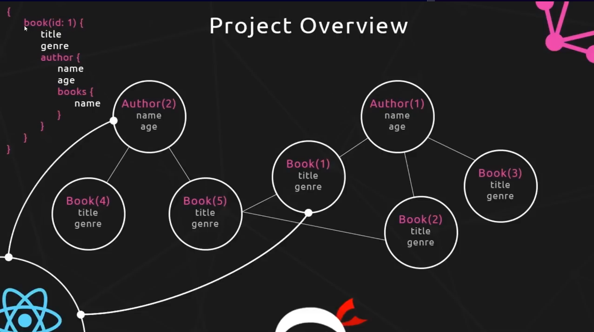
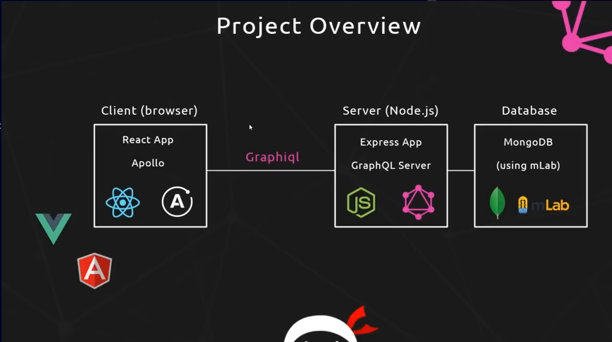

# GraphQL

- GraphQL is a powerful query language
- Allows for a more flexible & efficient way to interact with APIs rather than REST

### RESTful APIs

- Endpoints for getting a particular book
  ```bash
  domain.com/books/:id
  title, genre, reviews, authorid
  ```

- Endpoints for getting the author info of that book
  ```REST
  domain.com/authors/:id
  name, age, biography ,booksIds
  ```

- Endpoints for getting the reviews of that book
  ```RESTful
  domain.com/reviews/:id
  rating, review, bookId
  ```

### GraphQL Query

- Query for getting book data and it's author data (AND the other books)

  ```GraphQL
  {
    book(id: 1) {
      title
      genre
      reviews {
        rating
        review
      }
      author {
        name
        age
        biography
        books {
          title
          genre
        }
      }
    }
  }
  ```

> We get all the required data in a single query


